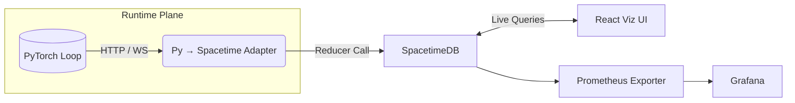

# NeuroSpacetime — Real-time Neural Network Visualization

> *"Glass brains, live."*

NeuroSpacetime is a real-time neural network visualization and monitoring system that allows you to observe weight changes, activations, and other neural network dynamics during training.

[](https://opensource.org/licenses/MIT)
[]()
[]()

---

## 🚀 Quick Start

```bash
# Clone the repository
git clone https://github.com/your-org/neurospace-time.git
cd neurospace-time

# Set up the development environment
just setup

# Run the system
just all

# Open the visualization UI
open http://localhost:7000
```

## 🧠 Key Features

- **Real-time visualization** of neural network training dynamics
- **Time-travel** capabilities to review historical weight changes
- **Gradient anomaly detection** to identify training issues
- **Multi-agent support** for distributed training environments
- **Modular architecture** for extensibility and maintainability

## 🛠️ Technology Stack

* **Language Stacks**
  * **Rust 1.79+** (server + reducers)
  * **Python 3.11** (model bridge)
  * **TypeScript 5.5 / React + Vite** (viz)
  * **WASM target: wasm32-unknown-unknown** (SpacetimeDB)

* **Core Dependencies**
  * `spacetimedb-sdk = "^0.4"`
  * `tokio`, `serde`, `tracing` (Rust)
  * `torch`, `requests`, `websockets` (Py)
  * `@cytoscape/react-cytoscapejs`, `zustand`, `d3-time` (TS)

* **Development Tools**
  * `just`, `cargo-make`, `ruff`, `pre-commit`, GitHub Actions

## 🏗️ Development Principles

### Test Driven Development (TDD)

All development follows strict TDD principles:

1. **Write tests first** before implementing any functionality
2. **Run tests** to verify they fail for the expected reasons
3. **Implement minimal code** to make the tests pass
4. **Refactor** while maintaining passing tests

See [TDD_WORKFLOW.md](docs/TDD_WORKFLOW.md) for detailed guidelines.

### Modular Architecture

The system is built with a highly modular architecture:

1. **Clear module boundaries** with single responsibilities
2. **Well-defined interfaces** between components
3. **Loose coupling** for independent development and testing
4. **High cohesion** within modules

See [MODULAR_ARCHITECTURE.md](docs/MODULAR_ARCHITECTURE.md) for detailed guidelines.

---

## 1. System Topology



* **Bridge**: single binary (`bridge.py`) running inside training host; asynchronous batching; configurable `SIG_LEVEL`.
* **Reducers**: compiled to WASM, live-hot-reload via SpacetimeDB CLI.

---

## 2. SpacetimeDB Schema (Rust DSL)

```rust
entity Weight {
    id: String,             // "layer12.attn.3.w44"
    value: f64,
    delta: f64,
    timestamp: i64,
    origin_sample: String,  // UUID
    agent_id: Option<String>,
}

entity ModelSnapshot {
    id: String,
    timestamp: i64,
    affected_weights: Vec<String>,
    reason: String,
}

index by_time on Weight(timestamp);
index by_layer on Weight(id);
```

**Why indexes?** Instant range queries & time-slider scrubbing.

---

## 3. Reducer Library (`crates/reducers`)

```rust
#[spacetimedb(reducer)]
fn update_weight(ctx: &Context, input: UpdateInput) -> Result<()> {
    let prev: Option<Weight> = ctx.db().get(&input.id)?;
    let delta = prev.map_or(0.0, |w| input.value - w.value);

    let rec = Weight { delta, ..input.into() };
    ctx.db().set(rec.clone())?;

    if delta.abs() > ctx.param("SIG_LEVEL", 0.1) {
        ctx.emit("sig_weight", &rec)?;
    }
    Ok(())
}
```

* **Reducer params**: tweak without recompiling.
* **Emit channels**: `sig_weight`, `snapshot`, `anomaly`.

---

## 4. Python Bridge (`bridge.py`)

```python
import torch, time, requests, uuid, queue, threading, json, os
ENDPT = os.getenv("NST_ENDPOINT", "http://localhost:5000/update_weight")
SIG_LEVEL = float(os.getenv("SIG_LEVEL", 0.1))

class NeuroHook:
    def __init__(self, model):
        self.model = model
        self.q = queue.SimpleQueue()
        self._install()
        threading.Thread(target=self._drain, daemon=True).start()

    def _install(self):
        for name, param in self.model.named_parameters():
            param.register_hook(lambda grad, n=name, p=param: self._enqueue(n, p, grad))

    def _enqueue(self, name, param, grad):
        new_val = param.data.cpu().float().mean().item()
        old_val = new_val - grad.mean().item()
        if abs(new_val - old_val) < SIG_LEVEL:
            return
        self.q.put({
            "id": name,
            "value": new_val,
            "timestamp": time.time_ns(),
            "delta": new_val - old_val,
            "origin_sample": str(uuid.uuid4()),
            "agent_id": None,
        })

    def _drain(self):
        while True:
            batch = [self.q.get()]
            while not self.q.empty():
                batch.append(self.q.get())
            requests.post(ENDPT, json=batch, timeout=0.2)
```

* **Attach in loop**: `NeuroHook(model)` before training.
* **Batched push** for throughput.

---

## 5. Visualization (`apps/viz`)

* **State API**: WebSocket subscription: `ws://stdb/slice?filter=layer12.*&delta>0.1`
* **UI Layers**
  1. **Graph View** (Cytoscape)
  2. **Timeline Heatmap** (Canvas)
  3. **Inspector Panel** (react-json-view)
* **Time Travel**: scrub slider ➜ query `Weight` range, animate.
* **Theme**: dark, ion-storm neon, weight intensity → node glow.

---

## 6. Dev Env & Commands

```bash
just setup          # install rustup, wasm-target, node, python venv
just run-stdb       # launch SpacetimeDB with reducers hot-loaded
just train-demo     # run tiny MNIST demo with bridge
just dev-viz        # start Vite dev-server
just all            # stdb + demo + viz concurrently
just test-all       # run all tests
just coverage       # check test coverage
```

---

## 7. CI / CD

* **Rust**: `cargo clippy --all -- -D warnings` + unit tests (mock ctx).
* **Python**: `pytest`, type-checked via `pyright`.
* **TS**: `vitest` + `playwright` UI smoke.
* **Docker** matrix builds –> GHCR.

---

## 8. Performance Notes

| Layer   | Event rate | Bridge batch | STDB insert | UI FPS |
| ------- | ---------: | -----------: | ----------: | -----: |
| Shallow |       2k/s |        500ms |       30k/s |     60 |
| Deep    |      50k/s |           1s |      100k/s |     45 |

Tune `SIG_LEVEL`, sampling mask, and `BATCH_INTERVAL`.

---

## 9. Roadmap

1. **MVP (Week 0-1)**
   * Establish modular architecture and testing framework
   * Weight + snapshot entities
   * Bridge hook POC
   * Graph view live-update

2. **Introspection v2 (Week 2-3)**
   * Activation entities
   * Gradient anomaly detection reducer
   * Prometheus exporter

3. **Multi-Agent Fabric (Week 4-6)**
   * Agent IDs, collision visual
   * Cross-model analytics API

4. **Prod Hardening**
   * TLS, auth tokens
   * Horizontal sharding
   * Helm chart

---

## 10. Examples and Visualization

We provide several examples to help you understand and use GlassNeuralFabric:

### Python Examples

* **MNIST Demo**: Basic example of capturing weight changes during MNIST training
* **Weight Visualization Demo**: Real-time visualization of weight changes with matplotlib
* **Simple Visualization Server**: Web-based visualization server for monitoring training

### Rust Examples

* **Weight Processor Demo**: Demonstrates using the weight processor directly in Rust

For detailed information on running these examples, see [README_EXAMPLES.md](README_EXAMPLES.md).

### Running the Visualization Server

```bash
# Start the visualization server
cd python
python examples/simple_visualization_server.py

# In another terminal, run your training script with NeuroCapture
# The weight changes will be automatically sent to the visualization server
```

## 11. Documentation

* [Development Plan](DEVELOPMENT_PLAN.md)
* [Examples Guide](README_EXAMPLES.md)
* [TDD Workflow](docs/TDD_WORKFLOW.md)
* [Modular Architecture](docs/MODULAR_ARCHITECTURE.md)
* [Project Setup Guide](docs/PROJECT_SETUP_GUIDE.md)
* [Code Review Checklist](docs/CODE_REVIEW_CHECKLIST.md)
* [Architecture Overview](docs/architecture/OVERVIEW.md)

---

## 12. License & Credits

MIT © NeuroSpark 2025.
Powered by SpacetimeDB, Rustaceans, and caffeine.
