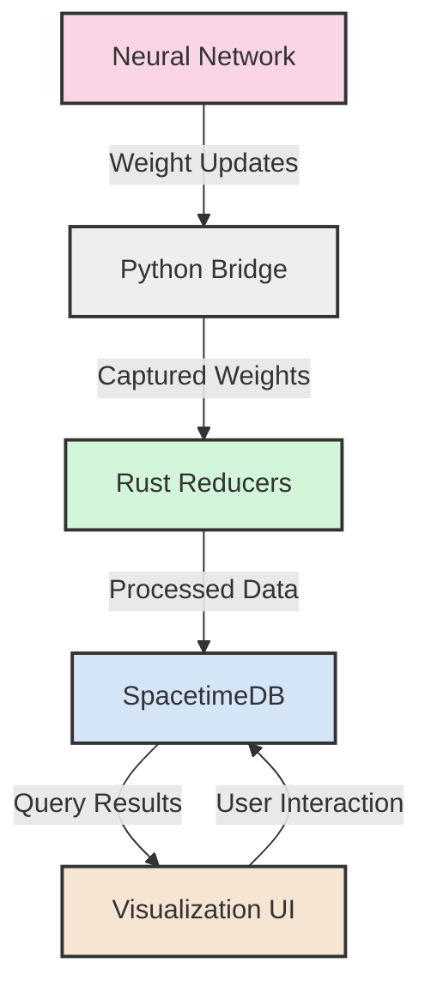
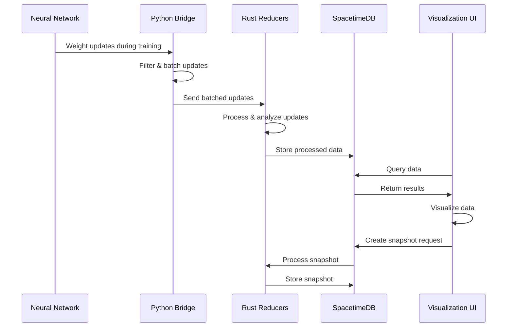
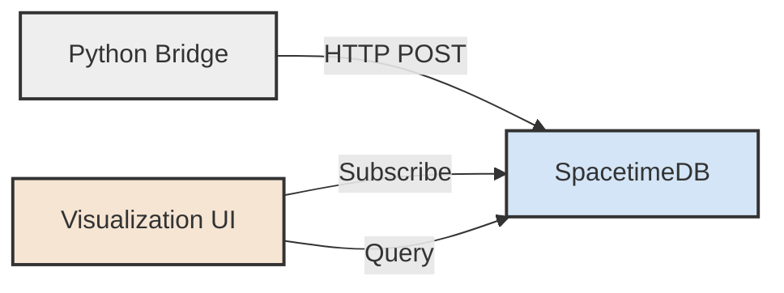
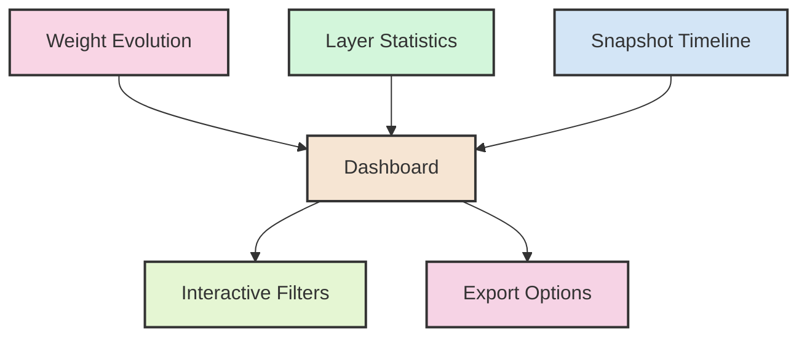
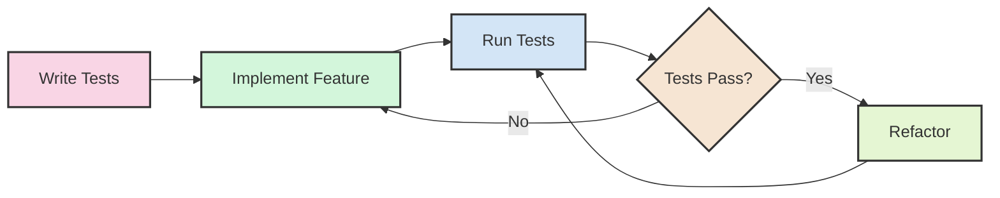
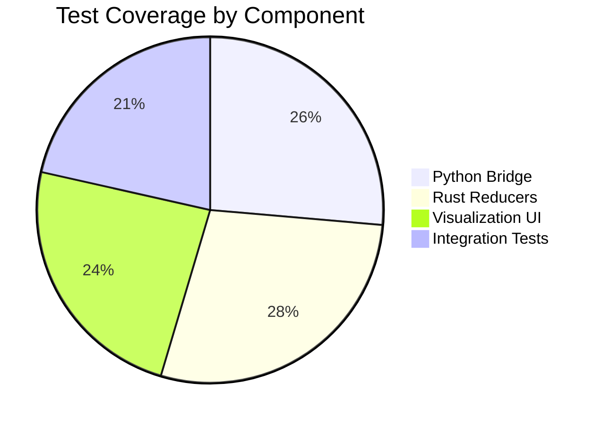
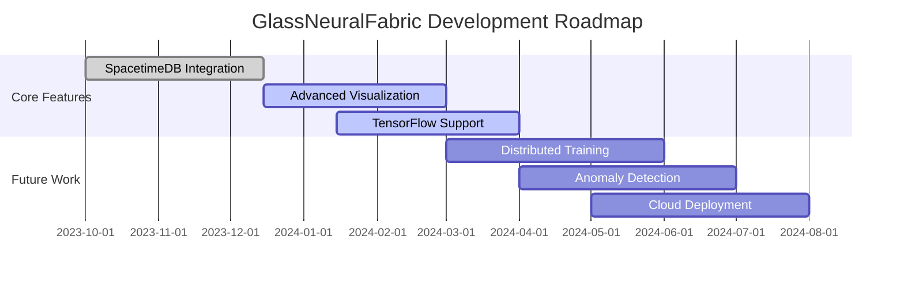

# GlassNeuralFabric

<p align="center">
  <strong>A transparent neural network monitoring and analysis framework</strong>
</p>

<p align="center">
  <a href="#features">Features</a> •
  <a href="#architecture">Architecture</a> •
  <a href="#installation">Installation</a> •
  <a href="#quick-start">Quick Start</a> •
  <a href="#examples">Examples</a> •
  <a href="#documentation">Documentation</a> •
  <a href="#development">Development</a> •
  <a href="#roadmap">Roadmap</a> •
  <a href="#license">License</a>
</p>

[](https://github.com/JtPerez-Acle/GlassNeuralFabric)
[](https://github.com/JtPerez-Acle/GlassNeuralFabric)
[](LICENSE)
[](https://www.python.org/)
[](https://www.rust-lang.org/)

---

## Overview

GlassNeuralFabric is an open-source framework for monitoring, analyzing, and visualizing neural network training in real-time. It provides transparent insights into weight changes, gradient flows, and model evolution, helping researchers and engineers understand and debug their neural networks.

The framework captures weight updates during training, processes them through a flexible reducer system, stores them in a scalable database, and visualizes them in real-time. It's designed to be modular, extensible, and compatible with popular deep learning frameworks.

### Current Status

GlassNeuralFabric is currently in active development with the following components implemented:

- ✅ Python Bridge for PyTorch integration
- ✅ Rust Reducers for weight processing
- ✅ SpacetimeDB integration
- ✅ Basic visualization components
- 🚧 Advanced visualization features (in progress)
- 🚧 TensorFlow integration (in progress)
- 📅 Distributed training support (planned)

## Features

- **Real-time Weight Monitoring**: Capture and analyze weight changes during training
- **Significant Change Detection**: Automatically identify significant weight updates
- **Model Snapshots**: Create snapshots of model state at key points in training
- **Visualization**: Real-time visualization of weight evolution and model state
- **SpacetimeDB Integration**: Scalable, real-time database for storing and querying neural network state
- **Framework Agnostic**: Compatible with PyTorch, TensorFlow, and other frameworks
- **Extensible Architecture**: Modular design with clear interfaces for customization
- **Distributed Training Support**: Monitor models trained across multiple devices or machines

## Architecture

GlassNeuralFabric follows a modular architecture with clear separation of concerns, making it easy to extend and customize.



### Core Components

1. **Python Bridge**: Captures weight changes from neural networks during training using PyTorch hooks
2. **Rust Reducers**: Processes weight updates, detects significant changes, and creates snapshots with high performance
3. **SpacetimeDB**: Stores and indexes weight updates and model snapshots for real-time querying
4. **Visualization UI**: Real-time visualization of weight evolution and model state with interactive dashboards

### Data Flow



## Installation

### Prerequisites

- Rust 1.70+ with `wasm32-unknown-unknown` target
- Python 3.8+
- SpacetimeDB CLI (optional, for database integration)
- Node.js 18+ (for visualization UI)

### Installing from Source

```bash
# Clone the repository
git clone https://github.com/JtPerez-Acle/GlassNeuralFabric.git
cd GlassNeuralFabric

# Install the just command runner (optional but recommended)
cargo install just

# Build the Rust components
just build-rust

# Install the Python bridge
cd python
pip install -e .

# Install SpacetimeDB (optional)
curl -sSf https://install.spacetimedb.com | sh

# Deploy the SpacetimeDB schema (optional)
just deploy-schema

# Install and build the visualization UI
cd ../apps/viz
npm install
npm run build
```

### Installing with pip (Python Bridge only)

```bash
pip install glass-neural-fabric
```

## Quick Start

### Monitoring a PyTorch Model

```python
import torch
import torch.nn as nn
from torch.optim import Adam
from bridge.src import NeuroCapture, CaptureConfig, attach_capture

# Define a simple model
class SimpleModel(nn.Module):
    def __init__(self):
        super().__init__()
        self.fc1 = nn.Linear(10, 5)
        self.fc2 = nn.Linear(5, 1)

    def forward(self, x):
        x = torch.relu(self.fc1(x))
        return self.fc2(x)

# Create your model
model = SimpleModel()

# Configure the capture module
config = CaptureConfig(
    sig_level=0.01,  # Capture changes greater than 0.01
    batch_interval=0.5,  # Send updates every 0.5 seconds
    endpoint="http://localhost:3000/reducer/update_weight",
    include_layers=["fc1.weight", "fc2.weight"]  # Only capture these layers
)

# Attach the capture module
capture = attach_capture(model, config)

# Train your model normally
optimizer = Adam(model.parameters(), lr=0.001)
for epoch in range(10):
    # Training loop...
    optimizer.zero_grad()
    outputs = model(inputs)
    loss = criterion(outputs, targets)
    loss.backward()
    optimizer.step()

    # Create a snapshot at the end of each epoch
    if epoch % 5 == 0:
        capture.create_snapshot(f"Epoch {epoch}", ["fc1.weight", "fc2.weight"])

# Detach when done
capture.detach_from_model()
```

### SpacetimeDB Integration



### Starting the Visualization UI

```bash
# Deploy the SpacetimeDB schema
just deploy-schema

# Start SpacetimeDB
just run-stdb

# Start the visualization UI
cd apps/viz
npm start
```

### Visualization Dashboard

The visualization dashboard provides real-time insights into your neural network's training process:



## Examples

GlassNeuralFabric includes several examples to help you get started:

### Python Examples

- **MNIST Demo**: Basic example of capturing weight changes during MNIST training
- **Weight Visualization Demo**: Real-time visualization of weight changes with matplotlib
- **SpacetimeDB Demo**: Complete example of using SpacetimeDB with GlassNeuralFabric
- **Simple Visualization Server**: Web-based visualization server for monitoring training

### Rust Examples

- **Weight Processor Demo**: Demonstrates using the weight processor directly in Rust

For detailed information on running these examples, see [README_EXAMPLES.md](README_EXAMPLES.md).

## Documentation

- [Architecture Overview](docs/architecture/OVERVIEW.md)
- [Python Bridge API](docs/python/API.md)
- [Rust Reducers API](docs/rust/API.md)
- [SpacetimeDB Integration](docs/spacetimedb/INTEGRATION.md)
- [Visualization UI](docs/visualization/UI.md)
- [Examples Guide](README_EXAMPLES.md)
- [Development Guide](docs/DEVELOPMENT.md)

## Development

GlassNeuralFabric follows Test Driven Development principles and a modular architecture. We prioritize code quality, test coverage, and maintainability.

### Development Workflow



### Project Structure

```
GlassNeuralFabric/
├── crates/                  # Rust crates
│   ├── reducers/            # Weight processing and analysis
│   │   ├── src/             # Source code
│   │   ├── tests/           # Unit tests
│   │   ├── examples/        # Example applications
│   │   └── schema/          # SpacetimeDB schema
│   └── test-utils/          # Testing utilities
├── python/                  # Python bridge
│   ├── bridge/              # Neural network integration
│   │   └── src/             # Source code
│   ├── examples/            # Example scripts
│   └── tests/               # Python tests
├── apps/                    # Applications
│   └── viz/                 # Visualization UI
│       ├── src/             # Source code
│       ├── public/          # Static assets
│       └── tests/           # UI tests
├── docs/                    # Documentation
└── scripts/                 # Utility scripts
```

### Test Coverage

GlassNeuralFabric maintains high test coverage across all components:



### Running Tests

```bash
# Run Rust tests
just test-rust

# Run Python tests
just test-python

# Run TypeScript tests
just test-ts

# Run all tests
just test-all

# Check test coverage
just coverage
```

For more information on contributing to the project, see the [Development Guide](docs/DEVELOPMENT.md).

## Roadmap

GlassNeuralFabric is under active development. Here's our roadmap for upcoming features:



### Short-term Goals (Next 3 Months)

- Complete the advanced visualization features
- Add TensorFlow integration
- Improve documentation and examples
- Enhance SpacetimeDB query performance

### Medium-term Goals (3-6 Months)

- Add support for distributed training
- Implement anomaly detection for weight changes
- Create a cloud deployment option
- Add more visualization types

### Long-term Vision

Our long-term vision is to make GlassNeuralFabric the standard tool for neural network monitoring and debugging, providing researchers and engineers with unprecedented insights into their models' behavior.

## Contributing

We welcome contributions from the community! Here's how you can help:

- **Report bugs**: Open an issue if you find a bug
- **Suggest features**: Have an idea for a new feature? Let us know!
- **Submit pull requests**: Implement new features or fix bugs
- **Improve documentation**: Help us make our documentation better
- **Share examples**: Create examples showing how to use GlassNeuralFabric

Please see our [Contributing Guide](CONTRIBUTING.md) for more details.

## License

GlassNeuralFabric is licensed under the MIT License. See [LICENSE](LICENSE) for details.

## Acknowledgements

- The SpacetimeDB team for their excellent database technology
- The PyTorch and TensorFlow teams for their deep learning frameworks
- All contributors to the project

---

<p align="center">
  
</p>

<p align="center">
  Made by JT Perez-Acle
</p>

<p align="center">
  <a href="https://github.com/JtPerez-Acle/GlassNeuralFabric">GitHub</a> •
  <a href="https://github.com/JtPerez-Acle/GlassNeuralFabric/issues">Issues</a> •
  <a href="https://github.com/JtPerez-Acle/GlassNeuralFabric/discussions">Discussions</a>
</p>